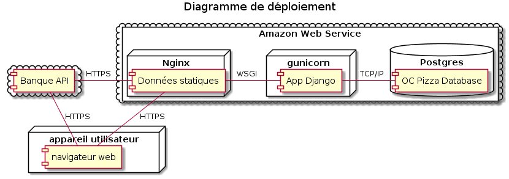

# Contexte

L'analyse fonctionnelle de la solution du site de gestion de pizzeria étant faite, il est maintenant demandé de décrire le domaine fonctionnel, les composants, le déploiement ainsi que la structure de la base de donnée.

# Description du domaine fonctionnel

# Description des composants du système

# Modèle Physique de données

# Base de données

Création de la base:

[01_database_structure.sql](https://github.com/Zepmanbc/oc_dapython_pr6/blob/master/doc/sql/01_database_structure.sql)

[02_database_basics.sql](https://github.com/Zepmanbc/oc_dapython_pr6/blob/master/doc/sql/02_database_basics.sql)

[03_database_view_procedure.sql](https://github.com/Zepmanbc/oc_dapython_pr6/blob/master/doc/sql/03_database_view_prcedure.sql)

remplissage de la base

[10_stock.sql](https://github.com/Zepmanbc/oc_dapython_pr6/blob/master/doc/sql/populate/10_stock.sql)

[30_clients.sql](https://github.com/Zepmanbc/oc_dapython_pr6/blob/master/doc/sql/populate/30_clients.sql) (https://mockaroo.com/schemas/154661)

[commandes.sql](https://github.com/Zepmanbc/oc_dapython_pr6/blob/master/doc/sql/populate/commandes.sql) ([commandes.py](https://github.com/Zepmanbc/oc_dapython_pr6/blob/master/doc/sql/populate/commandes.py))

Dump de la base : [oc_dapython_pr6.sql](https://raw.githubusercontent.com/Zepmanbc/oc_dapython_pr6/master/doc/oc_dapython_pr6.sql)

    mysqldump --routines --events oc_dapython_pr6 > oc_dapython_pr6.sql"

# Mise en situation

* Voir les pizzas disponibles en fonction des ingrédients (procédure *recette_vue* ou vue *v_0_recettes_possible*)
* Voir les commandes en cours dans une boutique (vues *v_1_commandes_boutique_\**)
* Voir l'inventaire dans une boutique (vue *v_1_stock_boutique_nord\**)
* Afficher une recette (procedure *voir_recette*)
* Calculer le chiffre d'affaire des boutiques (affiche les commandes payées du jour par boutique, vue *v_0_chiffre_d_affaire_journee*)
* Mise à jour du statut de la commande en fonction de l'avancé des préparations (trigger *after_update_commande_composition*)
* Mise à jour du stock quand une pizza passe en préparation (trigger *after_update_commande_composition*)
* Mise à jour du statut de la commande en fonction du paiement (et du statut) (trigger *before_update_commande*)
* Création du stock en fonction des modifications de boutiques ou d'ingrédients (triggers *after_delete_boutique* *after_insert_boutique* *after_delete_ingredient* *after_insert_ingredient*)