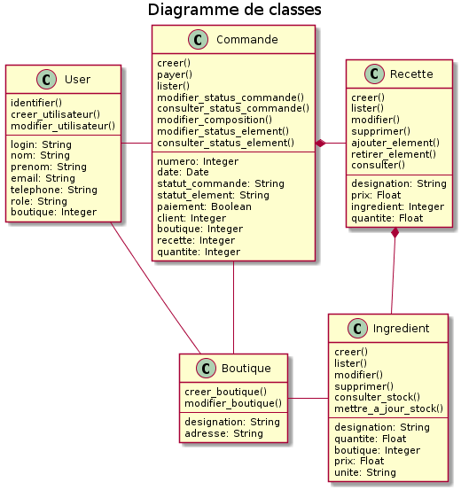

# Contexte

L'anaylse fonctionelle de la solution du site de gestion de pizzeria étant faite, il est maintenant demandé de décrire le domaine fonctionnel, les composants, le déploiement ainsi que la structure de la base de donnée.

# Description du domaine fonctionnel

# Description des composants du système

# Modèle Physique de donnée

# Base de donnée

Création de la base:

[01_database_structure.sql](https://github.com/Zepmanbc/oc_dapython_pr6/blob/master/doc/sql/01_database_structure.sql)

[02_database_basics.sql](https://github.com/Zepmanbc/oc_dapython_pr6/blob/master/doc/sql/02_database_basics.sql)

[03_database_view_procedure.sql](https://github.com/Zepmanbc/oc_dapython_pr6/blob/master/doc/sql/03_database_view_prcedure.sql)

remplissage de la base

[10_stock.sql](https://github.com/Zepmanbc/oc_dapython_pr6/blob/master/doc/sql/populate/10_stock.sql)

[30_clients.sql](https://github.com/Zepmanbc/oc_dapython_pr6/blob/master/doc/sql/populate/30_clients.sql) (https://mockaroo.com/schemas/154661)

[commandes.sql](https://github.com/Zepmanbc/oc_dapython_pr6/blob/master/doc/sql/populate/commandes.sql) ([commandes.py](https://github.com/Zepmanbc/oc_dapython_pr6/blob/master/doc/sql/populate/commandes.py))

Dump de la base : [oc_dapython_pr6.sql](https://raw.githubusercontent.com/Zepmanbc/oc_dapython_pr6/master/doc/oc_dapython_pr6.sql)

# Mise en situation

* Voir les pizzas dispo en fonction des ingrédients
* Voir les commandes en cours dans une boutique
* Voir l'inventaire dans une boutique
* Afficher une recette
* Calculer le chiffre d'affaire des boutiques
* Mise à jour du status de la commande en fonction de l'avancé des préparations
* Mise à jour du status de la commande en fonction du paiement (et du status)
* Mise à jour du stock quand une pizza passe en préparation